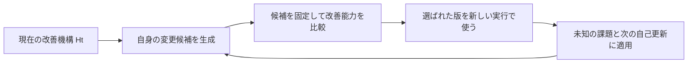

# ハーネスの RSI をどう設計し、確かめるか

このノートは、スキルの評価・改善プラグインを検討する中で得た、研究上の論点と設計判断を残すものです。STOP と Hyperagents を出発点に、2026年10月3日までに確認した関連研究の方法、実験、限界から、再帰的自己改善（RSI）を研究目標として、このリポジトリで何を検証するかを整理しています。実装するもの、順序、完了条件は[実装計画](../plans/agent-eval-tools.md)を正とします。

設計方針は、**改善の方法も変更対象にできる一つの機構を作り、その更新が次の改善を生む能力へ戻るかを、予算と未使用課題を定めた実験で確かめる**、というものです。自己改善の有効性を示した結論ではありません。自己更新の経路が動くこと、改善能力が高まること、その効果が続くことは、別々に確かめます。

## 1. ここまでに定めた方向

新プラグインは、このリポジトリの用途と実行環境にあわせて独立に設計・実装します。外部スキルの本文、コード、テンプレートを移植せず、公開資料を参考文献として扱います。独立実装は手段の選択であり、研究で示された有用な考えを避ける理由にはしません。

出発点となった Anthropic の[評価設計と hillclimbing](https://claude.dev/blog/automating-eval-design-and-hillclimbing/)からは、動く評価を整え、結果から仮説を作り、候補を比較して次の試行を選ぶ方法を重視します。OpenAI の[開発ワークフローの改善](https://developers.openai.com/cookbook/examples/codex/iterating-development-workflows-with-codex)と[Astra 向けのスキル・プロンプト設計](https://developers.openai.com/blog/rethinking-skills-and-prompts-for-gpt-6-astra)は、改善課題の選び方、知見の反映先、指示や手順を減らす候補を考える参考です。それぞれの位置付けは[計画の第1節](../plans/agent-eval-tools.md#1-新しいプラグインにする理由)に記しています。

実務からの学習と、RSI を目指す実験を一つの流れにつなぎます。実務は、何を良くする価値があるかを教える材料です。改善方法そのものを更新する実験は、その価値をより少ない手戻りで実現する方法を探します。実務の失敗報告がなくても、能力目標から課題を作り、改善探索を始められる構成にします。

既存の [agent-design-tools](../../plugins/agent-design-tools/README.md) と[改善・RSI の参照](../../plugins/agent-design-tools/skills/agent-workflow-design/references/agent-improvement-and-rsi.md)には、原因を切り分け、変更の効果を証拠で判断する方針があります。新プラグインでは、その方針を実行可能な比較、版の切り替え、次の実験へ接続します。既存文書との整合を保つだけで設計の良さが決まるとは考えず、初期版より有効かを試します。

既存の診断・探索方法も、変更権限のある範囲では検証と改善の対象です。まず既存スキルを変更せずに接続し、通常の保守に使う規則を能力探索全体へ広げたり、保守メモの整理で探索の候補や系譜を失ったりしないよう、新プラグイン側の適用範囲を整えます。既存側に具体的な問題があれば修正候補を比較し、通常用途の品質を維持できる場合だけ共通版へ反映します。この確認を[計画の統合条件](../plans/agent-eval-tools.md#既存の指示が探索を狭めないための統合条件)に含めます。変更できないホスト側の指示や依存先は、実験条件として明示します。

## 2. 自己改善の研究から押さえる点

STOP は COLM 2024 版（arXiv v3）、Hyperagents は arXiv v1 を参照しました。方法と実験・限界に加え、STOP の付録 A・K、Hyperagents の付録 D.2–D.4・E.5 を検討しました。以下は設計判断に必要な要点であり、論文全体の再現や公開実装の監査を完了したという意味ではありません。

### STOP：改善役を、改善した結果で評価する

STOP は、改善プログラムを自身へ適用し、候補が下流課題をどれだけ改善できるかで評価します。ただし、その能力は、さらに自身を改善する能力の代理です。実験の進歩は単調ではなく、モデルによっては悪化しています。付録 A の一般化の議論も、仮定を置いた課題分布に関するもので、無制限な再帰的向上を保証しません。[STOP：第3–5・7節、付録 A](https://arxiv.org/pdf/2310.02304v3)

この研究から私たちの設計に引き寄せて考えると、「自身を編集できた」を成果にするだけでは不十分です。まず新しい改善役に別の対象を改善させ、次に、新しい改善役が有効な後継を作れるかを確かめる必要があります。この二つを一つの得点で代用しない設計にします。

### Hyperagents：改善手続きも探索し、途中案を次に使う

Hyperagents は課題を解く部分と改善する部分を変更可能にし、過去の候補から分岐して探索します。改善役を固定して子孫の成果を測る実験では、別領域への転移を報告しています。一方、継続的な自己改善の比較では、転移あり・なしの最終成績差は統計的に有意ではありません。主要実験の親選択と評価手続きは固定で、親選択を変更する追加実験も、人が設計した方法への優位を示していません。[Hyperagents：第3・5.2–5.3・7節、付録 E.5](https://arxiv.org/pdf/2603.19461v1)

ここから採る設計上の判断は、改善方法を変更可能にしつつ、最初からあらゆる方針を自動獲得させないことです。現在の設計知識を反映した初期版を作り、変更を試せる余地を残します。また、途中案の探索価値と、実務に使う版としての採用可否を区別します。特定の集団探索アルゴリズムを採用する必然性までは、これらの研究から導きません。

両研究は、RSI を具体的な実験へ落とす重要な手掛かりです。このプラグインで改善が続くことを示す証拠は、これから得る必要があります。

### AIDE²：強いハーネスを改良することと、改良役が育つこと

2026年9月22日の AIDE² の報告は、既存の研究エージェントのハーネスを変更し、別のベンチマークでも効果を確認しています。主要実験では外側の改善役を固定しており、育ったハーネスを改善役に使う追加の「ignition test」は、優位を確定できない結果でした。内側に隠した採点の集約値も、外側の探索には使われるため、探索後の外部評価と区別する必要があります。[AIDE²：第2–3・5節、付録 C、arXiv v1](https://arxiv.org/html/2609.26457v1)

本計画に近い、ハーネス自身の変更と転移の実験です。同時に、強い対象を作れたことだけでは、その対象がより優れた自己改善役になったとは言えない例でもあります。このため、初期版を意図的に弱めずに比較する方針と、後継を生む能力を別に測る方針を維持します。論文の結果を、このプラグインで再現できる保証とは扱いません。

### Meta-Agent Challenge：開発能力の評価にも強い対照が要る

2026年6月の Meta-Agent Challenge は、予算内でエージェントを開発する能力を、開発用の評価と未使用のテストで測っています。検証した構成では人が設計した基準を超えるものが限られ、試行間のばらつきも大きいと報告しています。評価環境を分離し、正解やテストへのアクセスを制限する構成も、比較を成立させる方法として参考になります。[Meta-Agent Challenge：方法と実験、arXiv v1](https://arxiv.org/html/2606.04455v1)

これは、現在のあらゆるモデルの限界を確定する研究ではありません。本計画では、単発の成功例を能力の向上とせず、強い基準、複数の改善課題、誤採用の確認を置く根拠として使います。別ディレクトリに出力するだけでは、同じ評価上の分離を実現したことにはしません。

## 3. このリポジトリで目指す RSI

最初に問うべきことは、限られた時間と実行予算で、利用者にとって有効なスキルやワークフローを、今より良く作れるかです。そのためには、対象を直す技術だけでなく、改善課題の選択、原因診断、実験の組み方、途中結果の読み方、知見の再利用も改善できる必要があります。

そこで、各比較では基盤モデルの重みを固定し、これらの方法を表すスキル、参照、補助コード、再利用する知見を、一つの改善機構 `H` の変更可能な状態と考えます。`H` は改善対象を受け取り、証拠から候補を作り、実行・比較し、次の試行を選びます。対象には通常のスキルも、`H` 自身も指定できます。

私たちが目指す RSI は、**実行から得た証拠で改善機構が更新され、その更新が、未知の課題の改善と、次の有効な自己更新を生む能力に還流すること**です。ファイルを繰り返し直す回数ではなく、再利用可能な改善能力が育つかを見ます。長期的には改善の効率と扱える課題を広げたいのですが、その加速は実験の結論であって、設計の前提にはしません。

比較の成否を決める評価契約と、実行予算・権限を強制する部分は、候補から変更できない位置に置きます。その内側の診断や探索方針は変更できます。この境界は、改善手続きを永久に固定するためではなく、変更の効果を比較可能にするために設けます。作業用の評価器や課題選択も、外側の基準で検証できる範囲では改善対象です。

公開入口は `agent-improve` 一つとします。一つの仕組みであることは、一つのファイルや会話へすべてを詰め込むことではありません。対象の実行、候補の生成、独立した採点は、比較が成立するよう分けられます。自己改善のためだけに、さらに上位の改善役を無制限に追加する構成は採りません。

### 評価スキル自身を改善するときの根拠

評価スキルにも、課題を選ぶ、欠陥を検出する、原因を診断する、候補を採用するという異なる能力があります。これらを一つの自己採点でまとめると、採点が甘くなっただけでも改善に見えてしまいます。診断はその後の修正結果で、採点器は独立に正否を確認した成果物で、課題生成は欠陥検出とその課題を使った下流の改善で確かめます。詳細は[計画の第6節](../plans/agent-eval-tools.md#6-採点器と評価集合を先に確かめる)に定めます。

STOP や Hyperagents の主要実験を、最外周の正しさの基準まで自律的に改善できる実証とは読みません。Hyperagents が扱う採点の課題も、外側の評価そのものを候補が自由に書き換える意味ではありません。Anthropic の[評価監査](https://github.com/anthropics/skills/blob/main/skills/claude-api/shared/evals/eval-audit.md)が重視する、正例・負例や判定の校正を、この自己適用にも使います。

必要なのは、評価を不変にすることではなく、その評価を改善したと判断する根拠を、当の候補に所有させないことです。外側の基準に不備があれば、新しい比較として現行版から測り直せます。評価器や課題生成の変更も、この独立した根拠で比較します。最終確認を自分に都合よく変えただけの結果を、改善と数えないための条件です。独立した根拠を用意できない領域には未解決の不確実性が残り、エージェント同士の合意だけでは解消しません。

### 通常運用から手掛かりを得て、自己改善はまとめて行う

一つの改善機構を使うことと、毎回その機構自身まで更新することは別です。通常運用では改善機構の版を固定して対象を改善し、後で判断を確かめられる最小限の証拠と、得られた気付きを残します。自己改善は、目的と予算を定めた実行としてまとめて行います。これは運用負担と比較の成立を考慮した設計判断であり、研究から最適な実行頻度が決まったという意味ではありません。

記録は、気付きを要約するだけでは足りません。後から原因を診断できるよう、観測した食い違いを結果と版へ結び付けます。一方、毎回の追加モデル呼び出し、会話全文の恒久保存、全記録の読み込みは既定にしません。未検証の気付きを稼働中の指示へ自動的に取り込まず、選別・比較して採用した知見だけを通常運用へ返します。[計画の記録方針](../plans/agent-eval-tools.md#後の自己改善に残す証拠)

この構成では、蓄積した証拠から改善機構が自身の候補を作り、その更新が次の改善に役立つかを検証します。自己更新の頻度ではなく、更新後の能力と記録・検証を含む費用を測ります。開始には具体的な仮説や見直す理由を使い、記録件数だけを根拠にしません。現在の比較を壊す評価の不備はその場で修復し、共有する方法への恒久的な反映は影響に応じて検証します。[計画の自己改善の開始と進行](../plans/agent-eval-tools.md#蓄積した証拠から評価スキル自身を改善する)

## 4. 探索に残す候補と、実務へ採用する版

改善には途中で損をする変更がありえます。たとえば、診断用の情報を整理する変更が、最初の一回には余分な費用を要しても、続く複数の修正で同じ誤りを避ける助けになるかもしれません。これは設計上の仮説であり、将来役立つと言うだけで採用する理由にはなりません。

そのため、候補には二つの異なる判断を持たせます。

- **探索に残すか**：実行条件を守り、追加検証する具体的な仮説がある候補を、親の版、生成元、結果、追加予算とともに保持する。暫定成績が低い候補でも、限定した実験の出発点にはできる。
- **実務へ採用するか**：維持すべき能力と採用条件を満たし、外側の確認を終えた版だけを、通常の実行へ反映する。

初版から必要なのは、候補を破棄せずに識別し、選んだ過去版から一つずつ試せることです。多数の候補を並列に育てる基盤や、論文と同じ親選択式までは必要ありません。候補を残すことも無制限にはせず、再検討の理由と予算がなくなれば整理します。

この区別により、探索中の候補を運用版へ反映せずに、過去の候補から追加試行できます。古い候補から良い子孫が出たとしても、それだけで親の一般的な改善能力を認定しません。探索回数や課題の違いが結果を左右するため、候補を選ぶ手掛かりとして使い、比較条件をそろえた実験で確かめます。

## 5. 何を測れば RSI に近づいたと言えるか

自己改善の主張を、次の三つの問いへ分けます。これらは同じ改善機構に対する評価であり、別々の製品を作る意味ではありません。

### 新しい改善役は、対象を良くする能力が高いか

初期版 `H0` と変更候補 `H1` を固定して、同じ開始状態の対象、課題、モデル、予算を渡します。候補を作るときに使わなかった改善課題で、最終的な対象の品質、維持すべき能力、必要な費用、人の介入を比較します。

評価は「生成した候補の中に最高点があったか」で終えません。探索時に実際に選んだ候補を固定してから最終評価へ進め、改善役が有効な版を選ぶ能力も測ります。最終評価を見てから候補を選び直すことは避けます。課題ごとの改善余地が違うため、単純に点数を合算して一般能力とは呼びません。

### 新しい改善役は、次の有効な自己更新を生むか

`H1` が対象スキルを上手に改善しても、自身を上手に更新できるとはまだ言えません。次に `H1` で自己更新候補を作り、その候補の改善能力を別の課題で測ります。生成できたことと、有効な後継を作れたことを区別します。

効果の原因を確かめる必要がある場合は、共通の開始版を `H0` と `H1` にそれぞれ改良させ、後継を作る側だけを変える比較を行います。これにより、後継の品質が良いのは開始版が良かっただけなのか、更新方法も良くなったのかを調べられます。最初から毎回必須にする実験ではなく、再帰的な効果を主張する際の検証です。

### 自己更新への投資は、全体として役立つか

改善方法を初期版に固定した対照と、自己更新を許す実行に、同じ開始状態と総予算を与えます。自己更新の生成・検証、採点、失敗した試行、知見の整理も費用に含め、最後に同じ未使用課題で比べます。世代数だけをそろえても、一方が多くの計算を使っていれば効率の比較にはなりません。

初期版を固定した対照にも、同等に得られた実験記録を読む機会を与えます。自己更新版だけが追加の情報を得る比較で、方針の変更そのものの効果を主張しません。引き継いだ知見もハーネスの一部として版管理し、必要なら、共通知見を与えた比較を追加して寄与を切り分けます。

改善機構を育てる費用と、それを使う一件あたりの費用は区別して記録します。下流で効率が上がっても、育成費用を回収できる利用量は未確定かもしれません。対象の用途と予定する利用回数に照らして採用価値を判断します。

## 6. 小さく作り、研究の問いを順番に確かめる

実装は、自己適用までを最初のまとまりとして作ります。評価ランナーだけを完成させて RSI を将来の別計画へ送る構成にはしません。詳しい完了条件は[計画の第9節](../plans/agent-eval-tools.md#9-実装する順序と各段階の完了条件)にあります。

1. **課題と比較を成立させる。** 対象の版を確実に実行し、正例・負例を識別できる評価で、一つの比較を通す。
2. **初期版 `H0` を作って測る。** 現在の設計知識で使える方法を与え、異なる原因を持つ複数の改善課題で結果を残す。
3. **`H0` から自己候補を作り、比較して次の実行へ渡す。** 候補の保存と限定した再探索も扱う。ここまでが最初の実装範囲で、効果の実証は実測結果で判断する。
4. **後継の生成と蓄積を測る。** 固定した初期版との対照、必要に応じた共通開始版での比較を使い、次の改善を生む能力まで確かめる。
5. **扱える課題を広げる。** 実務や、中断・追加指示・再開を伴うワークフローへ進む。新しい課題群では基準を定め直し、その条件で比較する。

高価な評価をすべての候補に行う必要はありません。まず実行可能性と契約を検査し、小さな探索用課題で絞り、採用候補に外側の確認を行います。途中で打ち切った候補は未評価の範囲を残し、最終的に劣ると確定したことにはしません。評価の配分方法も、後に比較できる改善対象とします。

## 7. 現在の研究の方向と、モデル進化への対応

確認した研究には、改善役の変更に加えて、経験を再利用する方法、評価や課題生成を育てる方法、開発能力を厳しく測る方法が見られます。以下は関連する一次資料から整理した方向であり、研究分野全体の網羅的な調査や、方式間の性能比較ではありません。重みを固定したハーネスの改善と、重みを訓練する研究は区別します。

### 実行のフィードバックを、再利用できる変更へつなぐ

[GEPA（ICLR 2026）](https://proceedings.iclr.cc/paper_files/paper/2026/hash/0e9e708b6f48e14fd0ac29e167413f76-Abstract-Conference.html)は、実行の情報を言語で分析し、プロンプトの変更と比較へつなぎ、候補間の相補的な知見も利用します。[ACE（arXiv v1）](https://arxiv.org/html/2510.04618v1)は、再利用する文脈を構造化し、追加・修正と整理によって育てます。どちらも、最適化手続き自体が再帰的に良くなることの直接の実証とは区別します。

本計画では、実行で観測できた入出力と結果を診断に使い、知見を根拠と適用条件のある単位で残します。読み込み量や保守費も測り、単に長い記憶を作る方向にはしません。まずは候補と実験の記録から始め、独立した記憶基盤や特定の探索アルゴリズムは、必要性が確かめられたときに検討します。

### 評価と課題生成も、下流への効果で育てる

[CoNL（2026年1月、arXiv v1）](https://arxiv.org/html/2601.21464v1)は、批評後の回答の改善を仲間の判定で測り、それを含む報酬で、生成・批評・順位付けを担う方策を訓練します。自己生成の評価を使う学習の研究であり、外部の正しさを不要にしたと本計画で結論付ける根拠にはしません。参考にするのは、批評の価値を、その後の結果への寄与で測る考え方です。

[TTCS（2026年1月、arXiv v1）](https://arxiv.org/html/2601.22628v1)は、問題生成役と解答役の重みを更新し、解答能力に応じた課題を作る研究です。テスト問題に条件付けた生成を行う設定なので、本計画の最終確認用の課題を隠す実験とは異なります。本計画では、探索用の課題の難しさや配分を改善対象にする着想を採り、最終確認の課題を生成材料にする手順は採りません。

この方向は、評価を初めに作って永久に固定する設計にはしない理由になります。一方、難化、失敗率、評価役同士の一致だけでは、利用者の目的に近づいたとは判断できません。第3節の外側の根拠と、第5節の下流での比較を保ちながら、評価を生む能力も同じ改善機構で検証します。

### モデルが強くなった後も、効果を測り直せる構造にする

OpenAI の [Astra 向けの設計指針](https://developers.openai.com/blog/rethinking-skills-and-prompts-for-gpt-6-astra)は、能力の高いモデルに細かい手順を課しすぎる問題と、入口・参照の選択を見直す意義を示しています。これは、将来のモデルならスキルが不要になるという予測でも、すべての制約を削除する根拠でもありません。

本計画で重みを固定するのは、一つの比較で原因を確かめるためです。将来も同じモデルに固定する意味ではありません。モデル更新時には、新モデル上で現在版と候補版を比べ、補助指示の削除も試せる構成にします。採点モデルが替われば、その判定も再校正します。手順、モデル固有の補助、再利用する知見を識別できれば、能力の進歩を取り込みながら、不要になった仕組みを外せます。[計画のモデル更新時の検証](../plans/agent-eval-tools.md#モデルと実行環境の更新に対応する)

ここまでの研究を参考に、改善方法を変更対象とし、別の課題で検証して次の実行へ返す方針を採りました。補うべきだったのは、評価器や課題生成を改善する具体的な試験、モデル更新時の再比較、候補のコードから実験管理を守る実行上の境界でした。これらを計画へ反映しました。研究を理由に初版を巨大化させず、段階 2 までで自己適用を通し、その先は実測で判断する方針を維持します。

## 8. 実験で判断を更新する点

現時点で、次の事項は未決定です。結果によって構成や優先順位を変えます。

- **何を育てると効果があるか。** 診断、候補生成、課題選択、探索配分、知見の再利用のうち、初期版のどこが制約になるかを調べる。記録機構や自己編集を増やしただけでは効果としない。
- **どこまで転移するか。** 同じスキルの別ケース、別スキル、別領域を区別する。近い言い換えでの成功を、未知領域への適応としない。
- **途中案を残す価値があるか。** 限定した分岐探索が、現在の最良版からの探索に対して、追加費用に見合う結果を出すかを調べる。
- **評価をどこまで任せられるか。** 作業用のケース生成や採点器の改善が、外側の評価と食い違う場所を調べる。最終評価を繰り返し使った後は、新しい未使用課題が必要になる。
- **実用的な初期版からも改善できるか。** 合成の簡単な欠陥で動作を確認した後、実際に使える初期版との比較で判断する。初期版を弱くして自己改善の見かけを作らない。

研究ノートには、このような判断の理由と未確定の問いを残します。計画書には、採用した設計と次に確かめる実験を残します。実装後の結果が仮説にあわなければ、両方を更新します。ノートをそのままスキルの必須読み物や固定の手順書にはしません。

実装後の[評価方法の見直し](../agent-eval-tools/measurement-review.md)では、Inspect の採点・集約・再採点の設計と採点バイアス研究も照合しました。2026年10月5日の追加確認には、8〜9月投稿の評価研究と、OpenAI の改善ループ、スキル評価、モデル更新に関する公式資料を含めています。資料の日付と役割、読んだ範囲、設計への示唆はそちらで管理します。汎用の評価方法と付属のテキストランナーの範囲、任意の比較採点、実行数を増やす条件、Anthropic の公開スキルを参考文献にとどめる方針も整理しています。これは RSI の実証を追加した記録ではなく、下流の差を測る土台の修正です。
